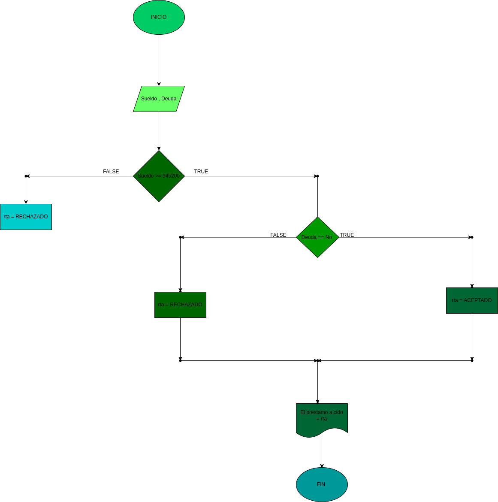

# prestamo bancario

programa para ver si usted puede adquirir un prestamo en el banco segun su salario y si tiene deudas anteriores 

# Analisis

variables de entrada 

Salario = el salario necesario para adquirir el prestamo 
Deuda = saber si tiene deudas anteriores 

variables de proceso

Salario >= numero ingresado
Deuda = si o no tiene deudas 

variables de salida

Aceptado = su prestamo fue aceptado 
Denegado = su prestamo fue denegado 

Nos indicara si se acepto o se denego su prestamo

# DISEÑO

# CONSTRUCCION
