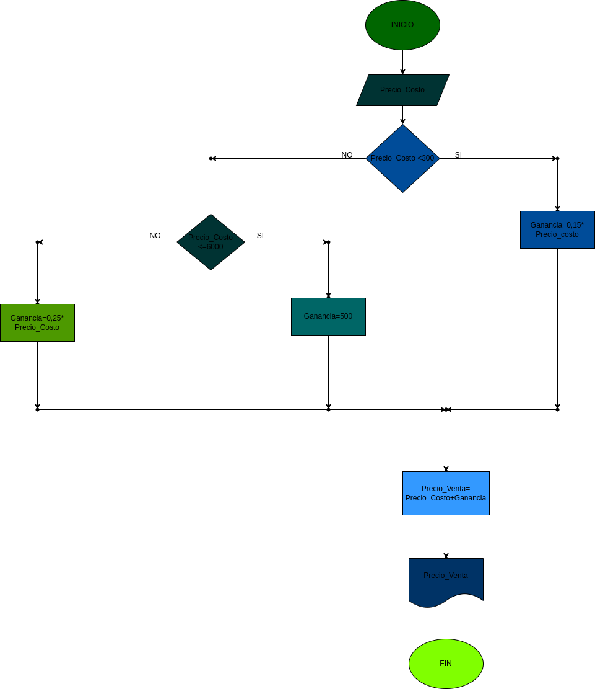

# Estructuras condicionales

programa que calcula el porcentaje de ganancia de ciertos productos dependiendo de su valor.

# ANALISIS

variables de entrada y proceso (entrada,procesamiento)

precio_costo: Necesario para sacar el porcentaje de los productos

variables de salida 

precio_costo<3000 precio_costi Ganancia=0,15 precio_costo Ganancia=0,25 precio_costo Ganancia=500 precio_venta=precio_costo +Ganancia

Nos indicara cual es el valor final de los productos.

# DISEÑO

# CONSTRUCCION

