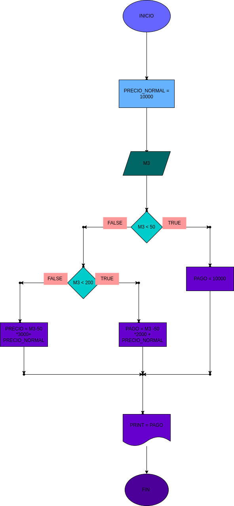

## GASTO DE AGUA
Programa para saber cuanto hay que pagar deacuerdo a su gasto de agua en m3
# ANALISIS

--Variables de entrada 

M3 = cuantos m3 gasto de agua
PRECIO_NORMAL = 10000

--variables de proceso

PAGO = se calcula lo que ahy que pagar y se almacena en esta variable

--Variables de salida

PAGO = se muestra cuanto debe ser el pago por el agua
--
# DISEÑO

# CONSTRUCCION