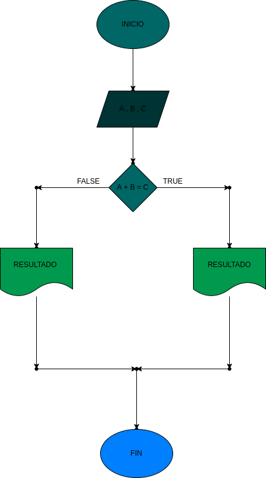

## Suma de los 3 numeros enteros
Programa para saber si el numero 1 y 2 es igual al numero 3
# ANALISIS

--Variables de entrada 
A = 1 numero
B = 2 numero
C = 3 numero

--variables de proceso

A + B = C : la suma de los 2 primeros numeros da el 3

--Variables de salida

Print : dice si los 2 primeros numeros son el 3
--
# DISEÑO

# CONSTRUCCION
