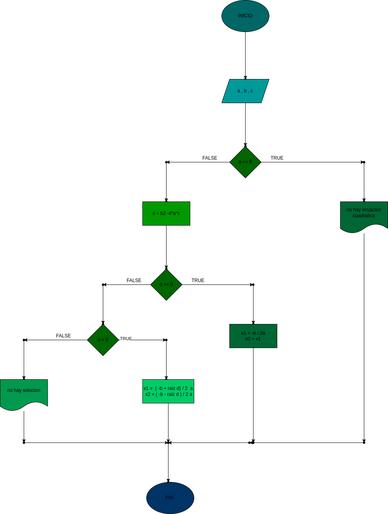

## raices de ecuacion de segundo grado
programa para  Calcular e imprimir las raíces de la ecuación de segundo grado de coeficientes reales

# ANALISIS

--Variables de entrada 
a = variable de numero 1
b = variable de numero 2
c = varibale de numero 3

--variables de proceso

d = varible en la que se hace la operacion para saber si son numeros reales posibles

--Variables de salida
x1 = la 1 varibles de salida de los 3 casos
x2 = la 2 variable de salida de los 3 casos
--
# DISEÑO

# CONSTRUCCION
