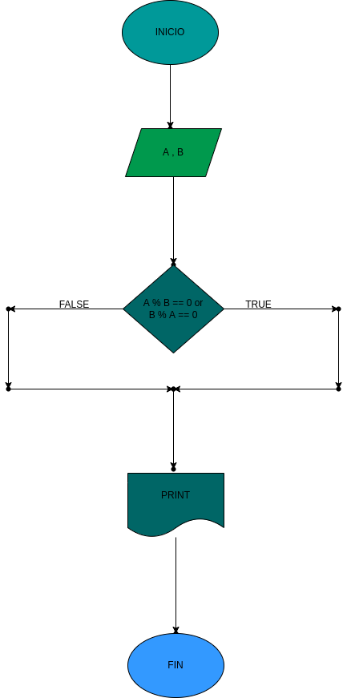

## Comparar uqe 2 numeros sean multiplos
Programa para saber si los numeros 1 y 2 son multiplos
# ANALISIS

--Variables de entrada 
A = 1 numero
B = 2 numero

--variables de proceso

A % B = 0 : esto se hace para saber si el resultado es 0 si es haci son multiplos

--Variables de salida

Print : dice si son multiplos o no
--
# DISEÑO

# CONSTRUCCION
